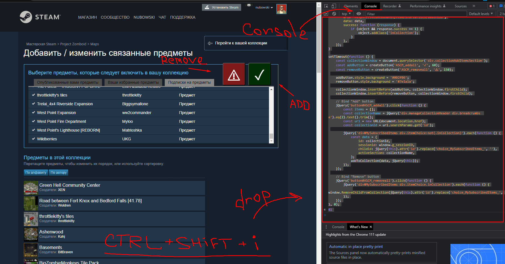

# Steam Workshop Collection Extender

SWCE is a simple JavaScript script that helps you manage your Workshop collections more efficiently. It adds two buttons to the collection management interface: one for adding all available items to a collection and another for removing all items from a collection.

## Features

- Add all available items to a collection with a single click.
- Remove all items from a collection with a single click.
- Stop waisting time by clicking and scroll all your 999 mods.

#### Knowing issue: some problems with requests so sometime you need to run script 2-3 time

## How To

1. Navigate to the collection management page on the Steam website (https://steamcommunity.com/)
2. Open your browser's developer console (press F12 or Ctrl+Shift+I)
3. Copy and paste the entire script from `WorkShopExtender.js` into the console and press Enter. Or drug'n'drop it on the console field.
4. Run it (by pressing Enter) and you will see two new buttons on the collection management page: a "✓" button to add all items and a "⚠" button to remove all items.
5. Click the "✓" button to add all available items to your collection, or click the "⚠" button to remove all items from your collection.

## Disclaimer

Please note that this script is provided "as is" and the author takes no responsibility for any consequences of its use. Always make sure to backup your collection data before making changes, and use this script at your own risk.

## Contributing

Feel free to submit issues, pull requests, or suggestions

## License

This mod is released under the [MIT License](LICENSE).

## Credits

- by nubowski
